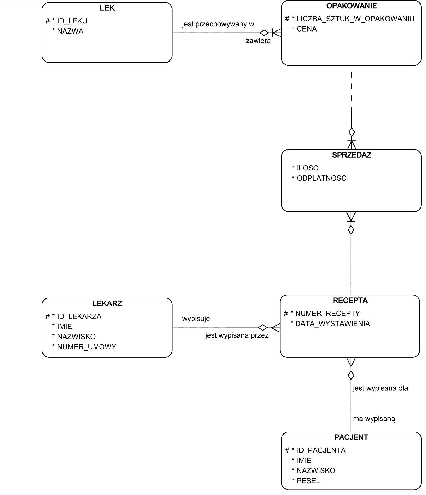
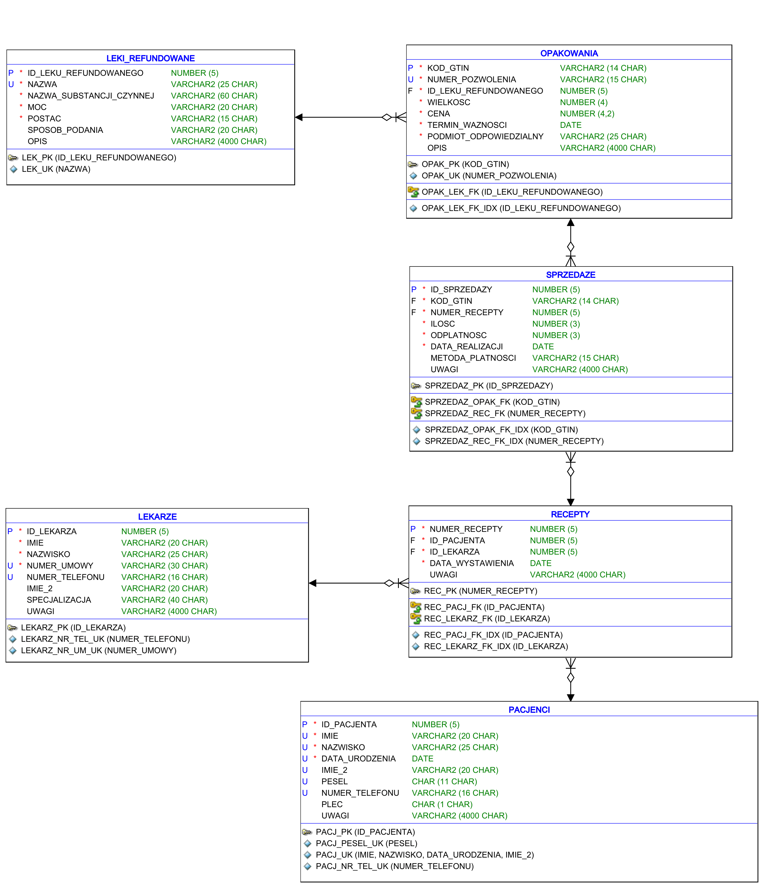

# Projekt bazy danych dla apteki

## Opis projektu
Projekt został wykonany w ramach przedmiotu BD2 (Bazy danych 2).  
Schemat bazy danych został stworzony tak, aby w bazie danych możliwe było zapisanie każdej sprzedaży leku, wraz z jego ceną i wielkością opakowania, a także dane recepty, dane pacjenta i lekarza. 

W ramach projektu powstał:
- Diagram związków encji - `model-ER`
- Model relacyjny - `model-relacyjny`
- Skrypty umożliwiające wygenerowanie struktur danych
- Skrypty umożliwiające dodanie danych testowych do bazy danych
- Skrypty testujące poprawność struktury danych i skuteczność więzów integralności

Wykonany przeze mnie schemat bazy został wykonany dla DBMS Oracle.

## Model ERD

## Model relacyjny
